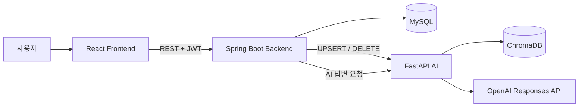
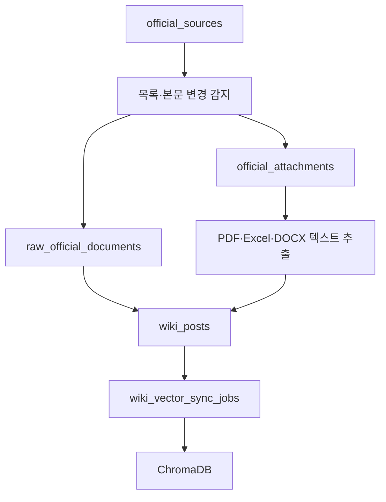
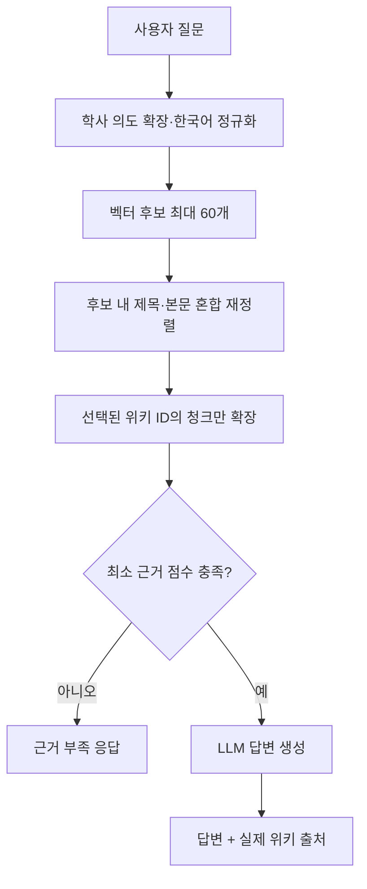

# 시스템 아키텍처

## 설계 목표

UniWiki-AI는 대학 정보의 원본, 게시용 위키, AI 검색 인덱스를 분리합니다. MySQL을 원본 데이터의 기준으로 사용하고 ChromaDB는 언제든 재구성할 수 있는 검색 인덱스로 취급합니다.

## 서비스 경계

| 서비스 | 책임 |
|---|---|
| Frontend | 화면, 라우팅, 로그인 상태, REST API 호출 |
| Backend | 인증, 권한, 위키·Q&A, 수집, 승인, 벡터 동기화 |
| MySQL | 사용자와 모든 원본·처리 상태 저장 |
| AI service | 청킹, 임베딩, 하이브리드 검색, RAG와 요약 |
| ChromaDB | 위키 청크와 임베딩 영속화 |
| OpenAI | 검색 문맥에 근거한 최종 답변 생성 |



## 인증 흐름

```text
로그인
→ 백엔드가 JWT 발급
→ 프론트 localStorage 저장
→ Axios가 Authorization 헤더 추가
→ JwtInterceptor 검증
→ @LoginUserId로 사용자 ID 전달
→ 서비스 계층에서 작성자·관리자 권한 확인
```

토큰이 필요한지는 Controller 메서드의 `@LoginUserId` 매개변수로 결정됩니다. 공개 조회 API는 토큰 없이 사용할 수 있습니다.

## 공식 자료 흐름



본문과 첨부파일 해시가 바뀐 문서만 갱신합니다. 공식 출처는 자동 게시할 수 있고, 일반 출처는 승인 전 초안으로 유지할 수 있습니다.

## 질문과 함께 만든 위키

```text
질문 + 답변
→ 작성자 또는 관리자가 답변 채택
→ 관리자가 질문/답변을 위키로 선정
→ 함께 만든 위키 생성
→ 벡터 동기화 작업 등록
→ 일반 위키와 같은 검색 컬렉션에서 조회
```

질문의 `CLOSED` 상태와 위키 선정은 별개입니다. 답변 완료만으로 위키가 생성되지는 않습니다.

## AI 답변 흐름



공식 위키와 함께 만든 위키는 동일한 컬렉션에서 동일한 점수 규칙으로 검색합니다. 출처별 문장 하드코딩 대신 벡터 유사도와 제목·본문의 정확한 일치를 결합합니다.

질문 처리 중에는 ChromaDB 전체 레코드를 조회하지 않습니다. 제한된 벡터 후보만 재정렬하고 선택된 위키 청크만 추가 조회하므로, 적재 문서 수가 늘어도 요청 한 건의 메모리 사용량은 검색 후보와 문맥 청크 제한 안에 머뭅니다.

## 장애 격리

- 위키 저장과 AI 동기화를 작업 큐로 분리해 AI 장애가 DB 쓰기를 막지 않습니다.
- 동기화 실패 작업은 상태와 오류를 저장하고 제한 횟수만큼 재시도합니다.
- OpenAI 오류, 시간 초과와 설정 오류를 구분해 백엔드로 전달합니다.
- ChromaDB는 Railway Volume에 저장해 AI 재배포 후에도 유지합니다.

## 배포 구조

```text
Vercel: frontend
Railway: backend, ai, MySQL
Railway Volume: /data ChromaDB
Local authorized worker: Selenium crawler
```

운영 세부 설정은 [DEPLOYMENT.md](DEPLOYMENT.md)를 참고하세요.
