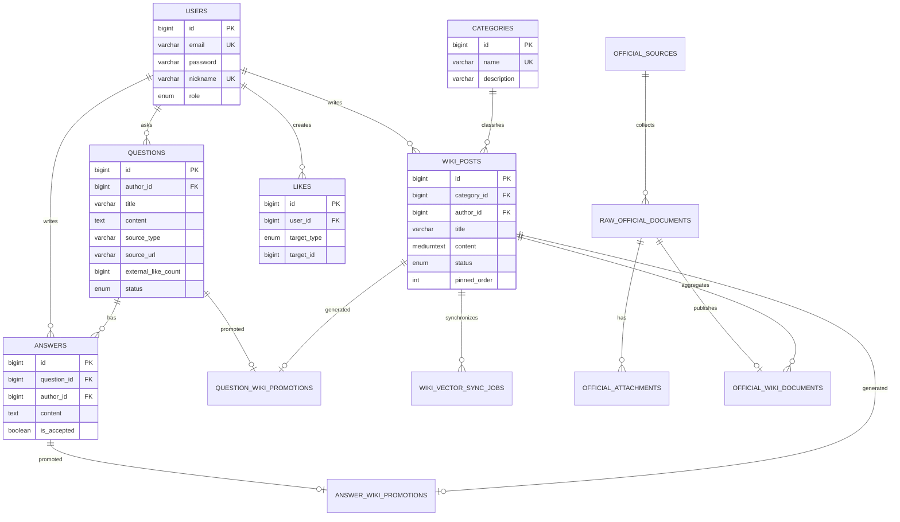

# 데이터 모델

MySQL 스키마의 기준 파일은 [`database/schema.sql`](../database/schema.sql)입니다. 아래 다이어그램은 서비스 이해에 필요한 핵심 관계를 요약합니다.

## 핵심 테이블

### 서비스 도메인

- `users`: 사용자와 `USER`·`ADMIN` 역할
- `categories`: 위키 분류
- `wiki_posts`: 공개·초안 위키 본문
- `questions`, `answers`: 질문 게시판
- `likes`: 위키·질문·답변의 다형 추천
- `question_wiki_promotions`, `answer_wiki_promotions`: 함께 만든 위키 선정 이력

### 공식 자료

- `official_sources`: 수집 URL과 CSS 선택자
- `raw_official_documents`: 원문과 SHA-256, 처리 상태
- `official_attachments`: 첨부파일 메타데이터와 추출 본문
- `official_wiki_documents`: 원문과 위키의 연결, 주제 통합 키

### 커뮤니티와 강의평

- `raw_community_posts`: 게시물, 댓글 JSON, 추천 수와 처리 상태
- `raw_lecture_evaluations`: 강의명·교수명·평점·본문
- `lecture_review_wiki_drafts`: 강의·교수별 검토용 초안 연결
- `everytime_wiki_documents`: 기존 수집 문서와 위키 연결

### AI 동기화

- `wiki_vector_sync_jobs`: `UPSERT`·`DELETE`, 재시도 횟수와 오류

ChromaDB에는 MySQL 엔티티를 복제하지 않고 위키 청크, 임베딩, `wikiPostId`, 제목, 카테고리와 청크 순서만 저장합니다.

## 상태 규칙

- 위키: `DRAFT`, `PENDING`, `APPROVED`, `REJECTED`
- 질문: 애플리케이션 기준 `OPEN`, `CLOSED`
- 벡터 작업: `PENDING`, `COMPLETED`, `FAILED`
- 원시 자료는 수집·승인·실패 상태를 별도로 보존

JPA 매핑을 변경할 때는 엔티티뿐 아니라 `database/schema.sql`과 관련 마이그레이션도 함께 변경해야 합니다.
